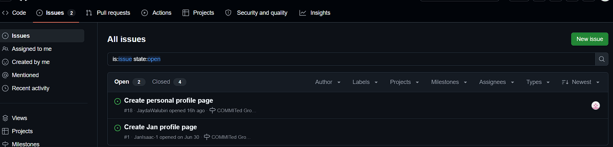
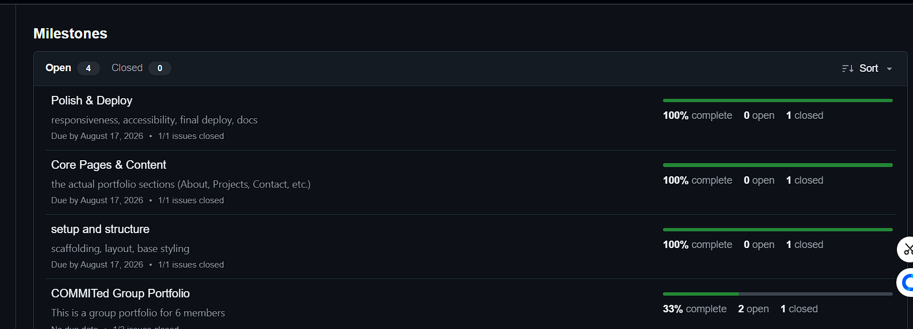
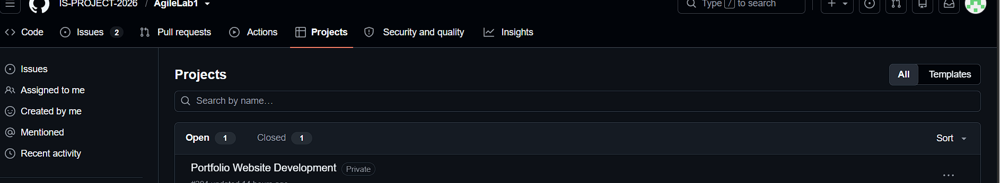
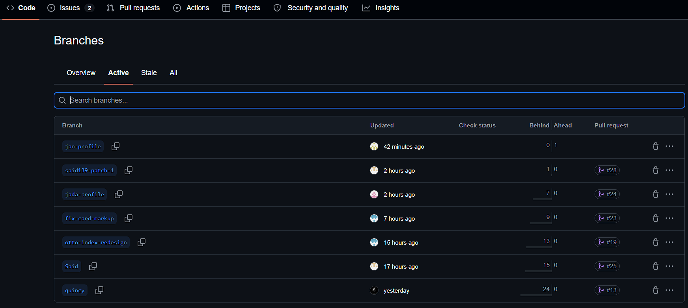
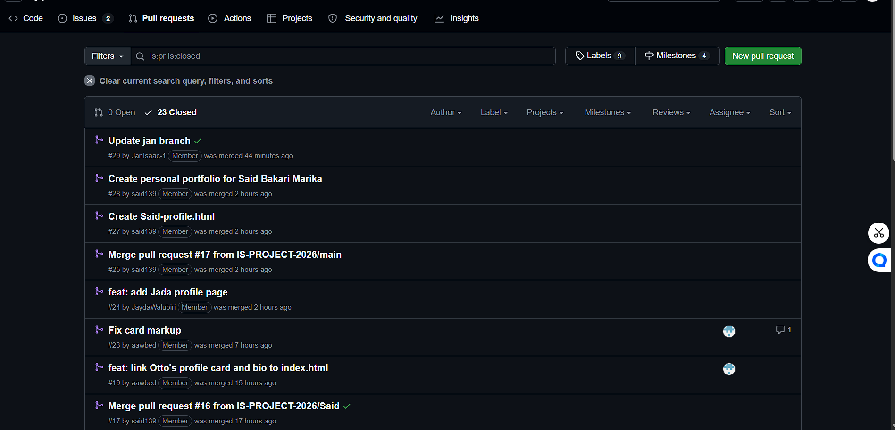

# Project Submission Report

## 1. Student Details

- **Full Name:** Jan Isaac
- **GitHub Username:** JanIsaac-1
- **Email:** jan.maina@strathmore.edu

---

## 2. Deployed Project Link

- **Live GitHub Pages URL:** [Paste your live deployment link here]

---

## 3. Reflection — Grounded in Your Git History

> **Rules:** Every answer below **must include a direct link** to the specific commit, PR, issue, or branch in your repository that demonstrates what you are describing. Answers without working links will not be graded. Generic explanations that could apply to any project will receive zero marks.
>
> **Marks:** A (2 marks) · B (1 mark) · C (1 mark) · D (1 mark) = **5 marks total**

### A. Your Best Commit

Paste the URL of the commit in your history that you think best demonstrates clean conventional commit practice (good type tag, clear subject, meaningful body or footer).

- **Commit URL:** https://github.com/IS-PROJECT-2026/AgileLab1/commit/8a51d62
- **Why this one?** his is my best commit because it follows the conventional commit format by using the feat: type and has a clear subject describing exactly what was changed. The commit updated both my personal profile page and the main index page, making it clear that the change introduced or updated a feature rather than being a vague update or changes commit.

### B. A Mistake or Struggle

Link to a commit, PR, or issue where something went wrong — a bad commit message you had to fix, a branch you had to delete and recreate, a PR that needed rework, or a deployment that broke. 

- **Link to the evidence:** https://github.com/IS-PROJECT-2026/AgileLab1/commit/05519fe
- **What happened and how did you recover?** A merge conflict occurred when changes from two different histories affected the same area of README.md. Git could not automatically combine the changes, so the conflict had to be resolved manually. The final resolution was committed  which is a two-parent merge commit and changed the conflicting executive information in the README.

### C. A Pull Request You're Proud Of

Paste the URL of the PR that best shows your self-review process — one where the description is clear, the issue linkage is correct, and the diff tells a coherent story.

- **PR URL:** https://github.com/IS-PROJECT-2026/AgileLab1/pull/15
- **What did you check before merging?** I checked that the changes to my Jan profile page and the main index page were complete and correctly connected before merging. PR #15 merged two commits from the jan-profile branch into main, including the conventional feat: update jan-profile page and main index page commit

### D. One Thing You Would Do Differently

If you had to restart this project from scratch with everything you know now, name one specific workflow decision you would change (not a code change — a Git/project management decision).

- **What would you change?** If I restarted the project, I would make the connection between issues, branches, and pull requests more explicit from the beginning. I would assign each issue to the responsible member and use issue-linked branch names and pull requests so that every piece of work could be traced from the original task through development and merging.
- **Link to the evidence of the original decision:** https://github.com/IS-PROJECT-2026/AgileLab1/issues/1

---

## 4. Screenshots of Key GitHub Features

Demonstrate your workflow mechanics by embedding your screenshots below.

> **CRITICAL FOR WORKING IMAGES:** Do not type manual folder paths. Edit this file directly on the GitHub web interface, click on the blank line below each prompt, and **paste (Ctrl+V / Cmd+V)** your screenshot. GitHub will automatically upload the file and generate a permanent, working image link for you.

### A. Milestones and Issues
*Provide a screenshot showing your active milestone(s) and the granular tracking issues linked directly to them.*

* **Caption:** The COMMITed team organized the project into four milestones covering the complete development workflow: COMMITed Group Portfolio, setup and structure, Core Pages & Content, and Polish & Deploy. The setup and structure, Core Pages & Content, and Polish & Deploy milestones each contain one closed issue and are 100% complete, demonstrating that the project tasks were tracked from initial scaffolding through content development, responsiveness, accessibility, documentation, and final deployment.

### B. Project Board
*Provide a screenshot of your GitHub Project Board with your issues organized dynamically across columns (To Do, In Progress, Done).*

* **Caption:** The GitHub Project Board demonstrates how the team's issues were organized and tracked through different stages of development, allowing the team to monitor outstanding, active, and completed work.

### C. Branching Architecture
*Provide a screenshot showing your local or remote Git branch list, highlighting your use of conventional, issue-linked naming patterns (e.g., `feat/`, `fix/`, `style/`).*

* **Caption:** The COMMITed team used separate Git branches for individual development work instead of making all changes directly on main. The repository currently shows branches including jan-profile, said139-patch-1, jada-profile, fix-card-markup, otto-index-redesign, Said, and quincy.

### D. Pull Requests & Traceability
*Provide a screenshot of a completed or open Pull Request (PR) on GitHub that clearly shows it is linked to a related development issue.*

* **Caption:**Demonstrates evelopment workflow for connecting my personal profile page to the main portfolio.

---

## 5. Merge Conflict Evidence

You must engineer **three merge conflicts**, each triggered by a **different cause** from those covered in the lecture. For Conflict 1, document the full resolution lifecycle. For Conflicts 2 and 3, provide the conflict marker screenshot and identify the cause.

> **Marks:** Conflict 1 full chronology (2 marks) · Conflict 2 (1 mark) · Conflict 3 (1 mark) · All three use distinct causes (1 mark) = **5 marks total**

---

### Conflict 1 — Full Chronology

**What cause did you use?** Same-file content conflict — two branches contained conflicting changes to the same section

#### Step 1: Generating the Clash
*Screenshot showing the merge attempt and the conflict warning.*

[PASTE SCREENSHOT OF ATTEMPTED MERGE / TERMINAL WARNING HERE]

* **Caption:** The merge attempt brought together two branches containing different changes to the same section. Git was unable to automatically combine the changes, resulting in a merge conflict that required manual intervention.

#### Step 2: Inside the Code Editor (Conflict Markers)
*Screenshot showing the raw, unresolved conflict markers (`<<<<<<< HEAD`, `=======`, `>>>>>>>`) in your editor.*

[PASTE SCREENSHOT OF RAW CONFLICT MARKERS HERE]

* **Caption:** 

#### Step 3: Resolution & Clean Merge
*Screenshot of your clean Git history or completed PR showing the conflict was resolved and merged.*

[PASTE SCREENSHOT OF CLEAN RESOLUTION HERE]

* **Caption:** The conflict was successfully resolved and committed. GitHub identifies the commit as resolve merge conflict and shows that it has two parents, confirming that two separate histories were merged after the conflict was resolve

---

### Conflict 2 — Different Cause

**What cause did you use?** [Name the type of conflict cause — must be different from Conflict 1]

**Why does this cause trigger a conflict?** [1–2 sentences explaining the mechanism]

[PASTE SCREENSHOT OF CONFLICT MARKERS FOR CONFLICT 2 HERE]

* **Caption:** [Brief description of the conflicting branches and file]

---

### Conflict 3 — Different Cause

**What cause did you use?** [Name the type of conflict cause — must be different from Conflicts 1 and 2]

**Why does this cause trigger a conflict?** [1–2 sentences explaining the mechanism]

[PASTE SCREENSHOT OF CONFLICT MARKERS FOR CONFLICT 3 HERE]

* **Caption:** [Brief description of the conflicting branches and file]

---
##
## 6. Feedback & Evaluation

To help improve this course for future engineering cohorts, please take 2 minutes to fill out the anonymous feedback form. Your honest review helps shape how this program is taught next semester!
- [ ] **Anonymous Evaluation Form:** [Course & Instructor Evaluation](https://forms.gle/YLybnsyXXErKEg3s9)

---
 
## Final Submission
 
Once your repository is complete, submit your work through the official submission form below. The form will **stop accepting responses after Monday, August 17th, 2026** — no late submissions will be accepted.
 
> **Submission Form:** [https://forms.gle/KrT4VxtFtkU3wtYu8](https://forms.gle/KrT4VxtFtkU3wtYu8)